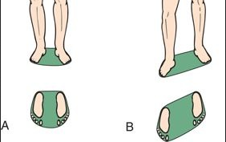

# Base of Support (BoS)

The base of support (BoS) refers to the area beneath an object or person that includes every point of contact that the object or person makes with the supporting surface. The shaded region in the image below represents BoS. Base of Support is primarily used to determine a person's stabilty (If COM lies within BoS then the person has steady gait and is stable).

**This repository can be used to estimate BoS for static balance**.

<div align="center">
  
  <p>Credit: Sheik Abdul Khadir A.M.K., PhysioPedia</p>
</div>

# To use this repository

Anaconda or any of its variants must be installed, intel realsense d435 camera is required.

```
conda env create -f requirements.yml
conda activate bos
##cd to the required directory
python -u mainWindow.py
```

# At a glance
<p>The purple shaded region is the BoS</p>
<div align="center">
  <video src="./images/bos.mp4" type="video/mp4">
  </video>
</div>
